# Audio Sync App — Workflow Document

> **What we're building:** A mobile app where one device (the Master) records audio and all other devices (Controllers) play it at exactly the same time.
---

## 📋 Table of Contents

1. [What Is This App?](#what-is-this-app)
2. [How It All Fits Together](#how-it-all-fits-together)
3. [Phase 1 — Can We Record Audio?](#phase-1--can-we-record-audio)
4. [Phase 2 — Can Devices Talk to Each Other?](#phase-2--can-devices-talk-to-each-other)
5. [Phase 3 — Can We Send Audio Over the Network?](#phase-3--can-we-send-audio-over-the-network)
6. [Phase 4 — Can We Get All Clocks Ticking Together?](#phase-4--can-we-get-all-clocks-ticking-together)
7. [Phase 5 — Can Controllers Play Audio Smoothly?](#phase-5--can-controllers-play-audio-smoothly)
8. [Phase 6 — Does It Stay in Sync for a Long Time?](#phase-6--does-it-stay-in-sync-for-a-long-time)
9. [Phase 7 — Does It Work With Many Devices?](#phase-7--does-it-work-with-many-devices)
10. [Phase 8 — What Happens When Things Go Wrong?](#phase-8--what-happens-when-things-go-wrong)
11. [Phase 9 — What Does the App Look Like?](#phase-9--what-does-the-app-look-like)
12. [Phase 10 — Is It Ready for the Real World?](#phase-10--is-it-ready-for-the-real-world)
13. [Full Timeline](#full-timeline)

---

## What Is This App?

Think of it like a **conductor and an orchestra**. One person (the Master) speaks or plays audio into their phone. Every other phone in the room (the Controllers) plays that same audio at the exact same moment — like a perfectly synced speaker system, but using regular phones over WiFi.

### The Three Players

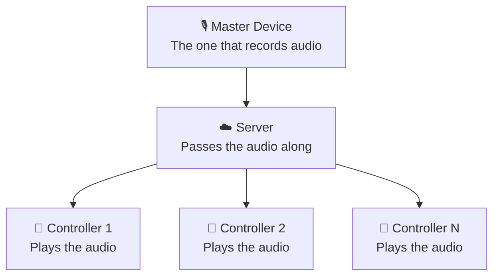

| Who | What They Do |
|-----|-------------|
| **Master** | Records audio and sends it out |
| **Server** | Sits in the middle and passes audio to everyone |
| **Controller** | Receives audio and plays it in sync |

---

## How It All Fits Together

Here's the big picture of how audio travels from the Master to every Controller:

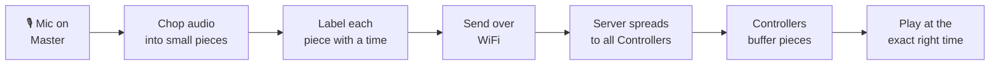

---

## Phase 1 — Can We Record Audio?

### 🎯 What We're Doing
Before any networking, we just want to prove that the phone can **record 1 minute of audio and save it**. Nothing else. No sending, no receiving.

### Why This Phase Exists
If the recording itself is broken — bad quality, gaps, crashes — nothing else will work. We fix the foundation first.

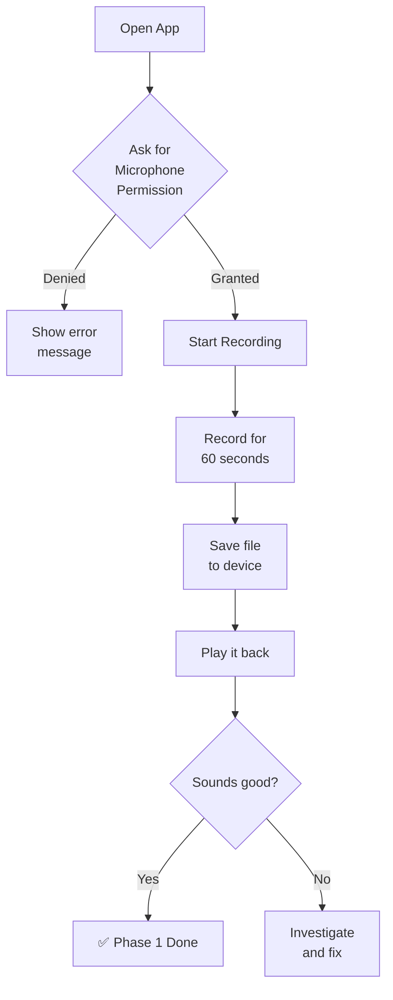

### What We Check Before Moving On

| Test | We Pass If... |
|------|--------------|
| Microphone permission | App asks nicely and works when granted |
| 60 second recording | File is saved with no crashes |
| File is saved | We can find it on the device |
| Playback | Audio is clear with no gaps or noise |

---

## Phase 2 — Can Devices Talk to Each Other?

### 🎯 What We're Doing
We set up a **live connection** between the Master and Controllers over WiFi. No audio yet — we just want to see devices say hello to each other and measure how fast messages travel between them.

### Think of It Like This
Imagine sending a letter to a friend and they reply immediately. The time it takes for that round-trip tells us how fast our network is. We need this to be fast before we can sync audio.

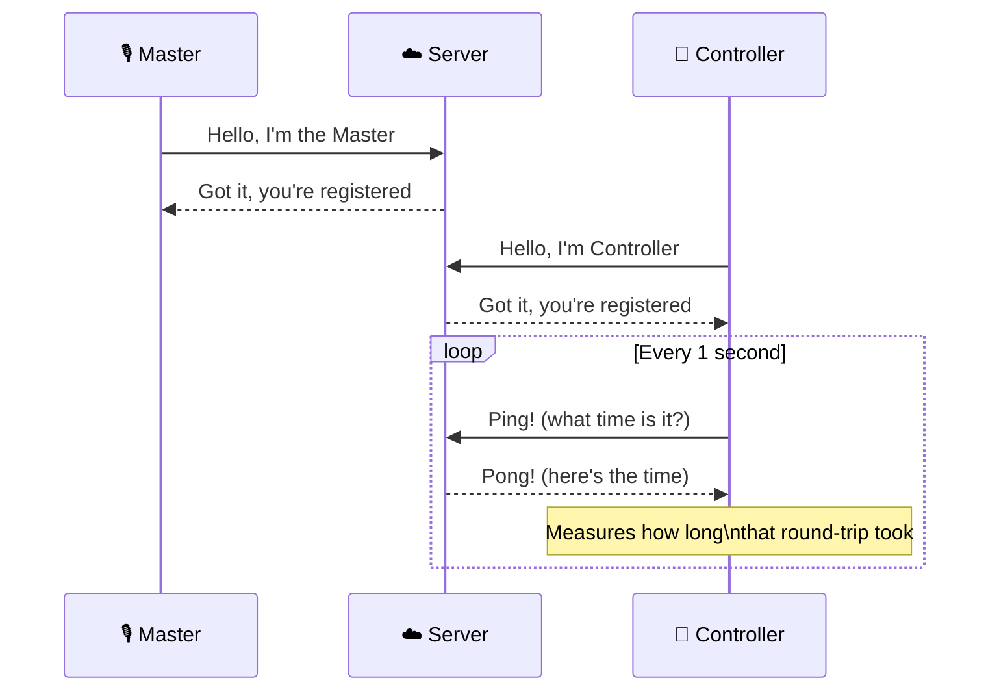

### What We Check Before Moving On

| Test | We Pass If... |
|------|--------------|
| Master connects | Server recognises the Master |
| Controller connects | Server recognises each Controller |
| Messages travel fast | Round-trip takes less than 30ms on WiFi |
| Disconnect and reconnect | Device reconnects on its own within 3 seconds |

---

## Phase 3 — Can We Send Audio Over the Network?

### 🎯 What We're Doing
Now we actually **send live audio** from the Master to Controllers. The audio might sound choppy at this stage — that's fine. We just want to confirm the audio is arriving.

### How Audio Gets Sent

Think of audio like a long ribbon. We chop it into short pieces (every 40ms), label each piece with a number, and fire them across the network one by one.

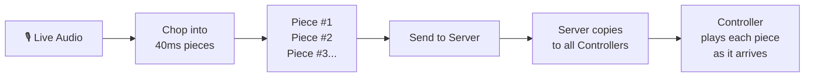

### What a Single Audio Piece Looks Like (In Plain Words)

Every piece of audio we send contains three things:
- **A sequence number** — so we know what order they go in (e.g. piece #42)
- **A timestamp** — so we know exactly when the Master sent it
- **The audio data itself** — the actual sound

### What We Check Before Moving On

| Test | We Pass If... |
|------|--------------|
| Audio pieces arrive in order | Sequence numbers go up one by one |
| No pieces are lost on WiFi | Every number arrives, none skipped |
| Controllers hear something | Audio plays, even if a bit rough |
| Server handles the load | Server doesn't slow down or crash |

---

## Phase 4 — Can We Get All Clocks Ticking Together?

### 🎯 What We're Doing
Every phone has its own internal clock, and they're never perfectly in sync. If Controller A's clock is 50ms behind the Master's, it will play audio 50ms late. This phase **aligns all clocks** so every device is working from the same time reference.

### Why Clocks Drift Apart
Imagine everyone in a room starts their stopwatch at "Go!" — but some people react a little late, some clocks run slightly fast. After 10 minutes, everyone's stopwatch shows a slightly different time. We need to constantly correct for this.

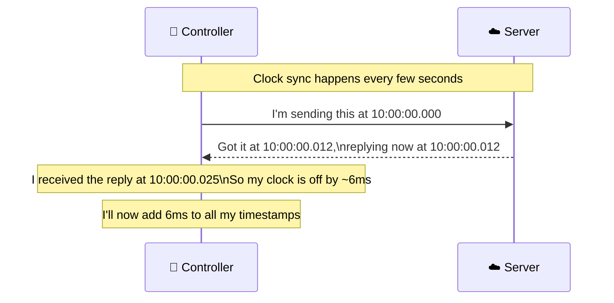

### How Playback Gets Scheduled After Sync

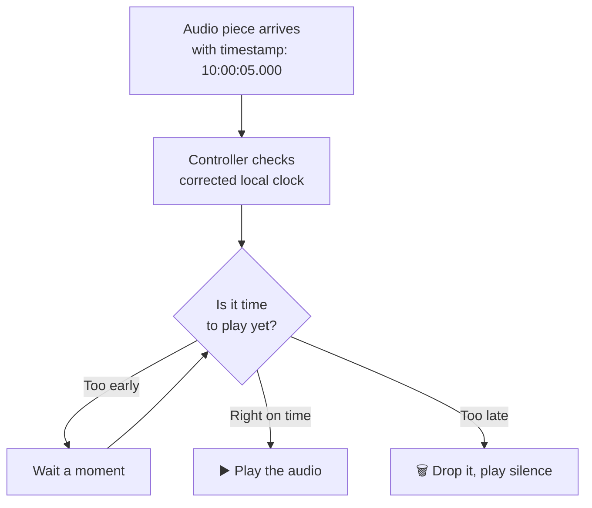

### What We Check Before Moving On

| Test | We Pass If... |
|------|--------------|
| Clocks align quickly | All devices agree on the time within 200ms of connecting |
| Clocks stay aligned | After 5 minutes, offset is still less than 5ms |
| Audio plays at the right moment | No early bursts or late delays |
| Late pieces are detected | App warns when a piece can't be played on time |

---

## Phase 5 — Can Controllers Play Audio Smoothly?

### 🎯 What We're Doing
Network connections aren't perfectly smooth — sometimes pieces arrive a bit late, sometimes early, sometimes out of order. This phase adds a **small waiting area** (called a buffer) on each Controller so it can absorb these bumps and still play audio smoothly.

### The Buffer Explained Simply

Think of it like a water tank. Water (audio) flows in from the pipe (network) at an uneven pace. The tank holds a small reserve so that even if the pipe slows for a second, the tap (speaker) keeps flowing steadily.

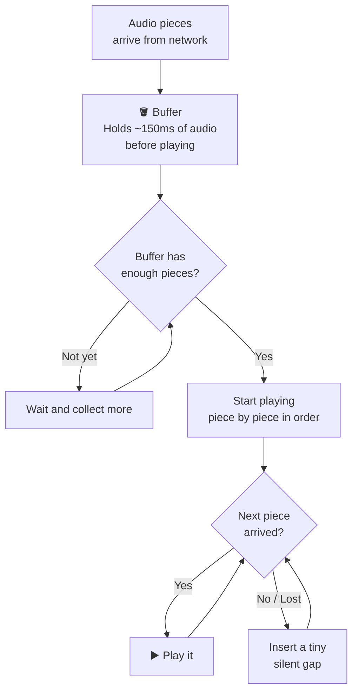

### What We Check Before Moving On

| Test | We Pass If... |
|------|--------------|
| Buffer fills before playback starts | First sound plays only after ~150ms of audio is ready |
| Out-of-order pieces are fixed | Audio always plays in the right order |
| Lost piece → brief silence | App handles it gracefully, no crash |
| Smooth playback over 5 minutes | No stutters or glitches on a WiFi network |

---

## Phase 6 — Does It Stay in Sync for a Long Time?

### 🎯 What We're Doing
Even after clocks are aligned, devices slowly drift apart over time — like clocks on a wall that run at slightly different speeds. This phase adds a **continuous correction system** that keeps everything tight over a 30-minute session.

### How Drift Gets Corrected

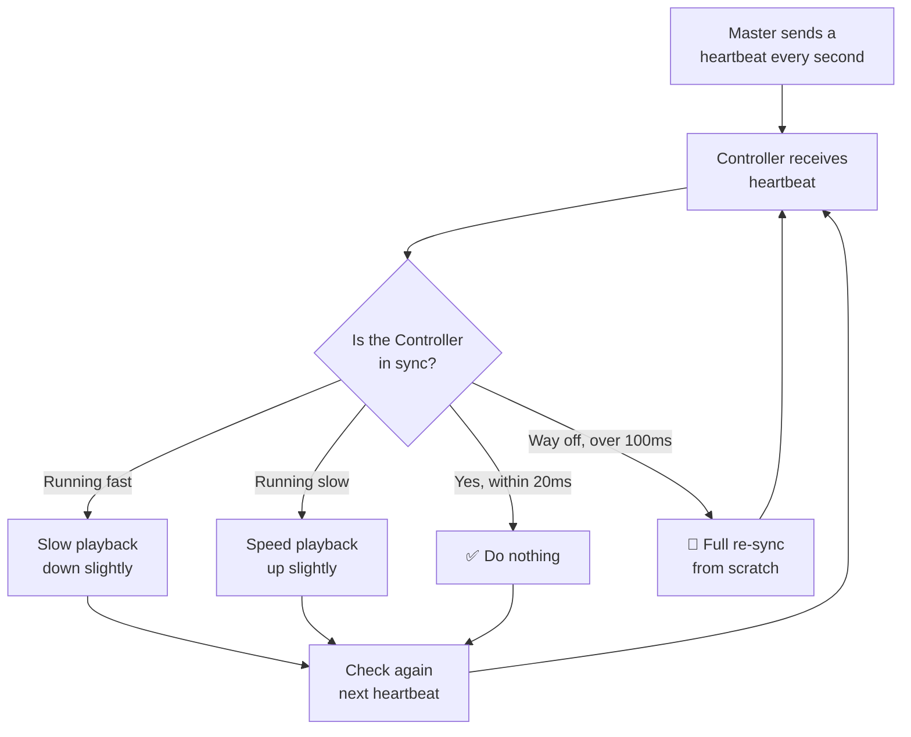

### What We Check Before Moving On

| Test | We Pass If... |
|------|--------------|
| 30-minute session stays in sync | Drift stays under ±20ms the whole time |
| Heartbeats keep arriving | No gap longer than 3 seconds |
| Speed adjustments are tiny | You can't hear any change in audio speed |
| Two controllers match each other | Less than 10ms difference between any two Controllers |

---

## Phase 7 — Does It Work With Many Devices?

### 🎯 What We're Doing
We test with more and more Controllers at the same time — 5, then 10, then 20+ — to make sure the system doesn't fall apart under pressure.

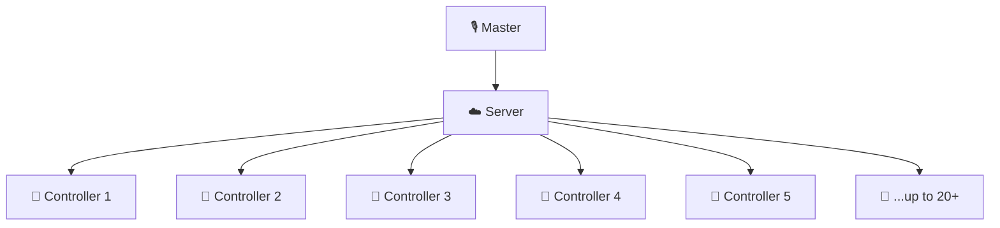

### Bandwidth Reality Check

The more Controllers you add, the more internet/WiFi traffic the server creates. The table below shows roughly how much data flows:

| Controllers | Data per second |
|-------------|----------------|
| 5 | ~40 KB/s |
| 10 | ~80 KB/s |
| 20 | ~160 KB/s |

This is well within normal WiFi capacity — even a basic home router handles this easily.

### What We Check Before Moving On

| Test | We Pass If... |
|------|--------------|
| 5 Controllers in sync | All within ±15ms of each other |
| 10 Controllers in sync | All within ±20ms |
| 20 Controllers in sync | All within ±30ms |
| Server stays healthy | No slowdown or crashes at 20 Controllers |

---

## Phase 8 — What Happens When Things Go Wrong?

### 🎯 What We're Doing
Real life is messy. WiFi drops. Phones go to sleep. The Master app crashes. This phase makes sure the app **recovers gracefully** without the user having to do anything.

### Reconnection Flow

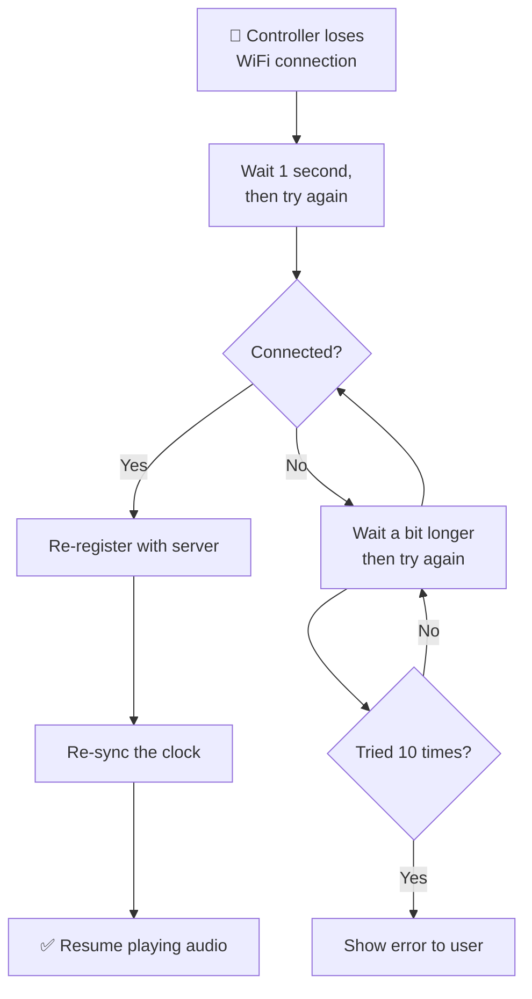

### App Goes to Background

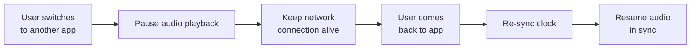

### What We Check Before Moving On

| Test | We Pass If... |
|------|--------------|
| WiFi drops → auto-reconnect | Reconnects within 5 seconds, audio resumes |
| App goes to background → comes back | Resumes in sync within 1 second |
| Master restarts | All Controllers detect this and reset |
| No crash after 20 reconnect cycles | App stays stable throughout |

---

## Phase 9 — What Does the App Look Like?

### 🎯 What We're Doing
Build a clean, simple interface for both the Master and Controller views. The user should always know what's happening at a glance.

### Master Screen

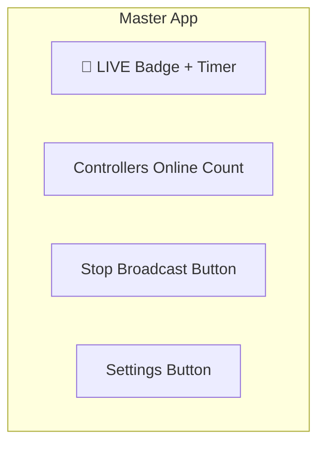

### Controller Screen

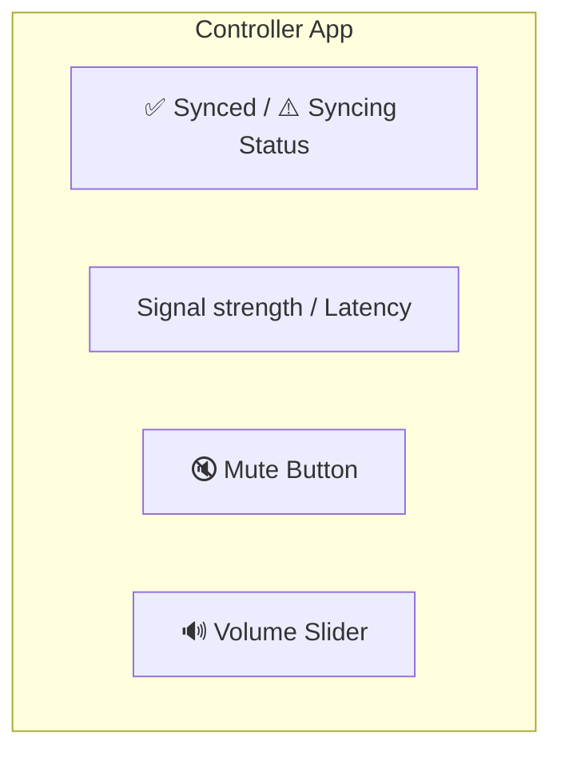

### Status Indicators

| What It Shows | States |
|--------------|--------|
| Connection | 🔴 Disconnected → 🟡 Connecting → 🟢 Connected |
| Sync Health | ⚠️ Syncing → ✅ Synced → 🔴 Drifting |
| Buffer | 🔴 Empty → 🟡 Low → 🟢 Healthy |

### What We Check Before Moving On

| Test | We Pass If... |
|------|--------------|
| Master can start and stop with one tap | Works every time |
| Controller count updates live | Shows correct number |
| Mute works without losing connection | Audio stops but stays connected |
| App doesn't feel slow during streaming | UI is responsive at all times |

---

## Phase 10 — Is It Ready for the Real World?

### 🎯 What We're Doing
The final phase is about making the app **safe, efficient, and reliable** for real users — not just in testing conditions.

### Key Things to Lock Down

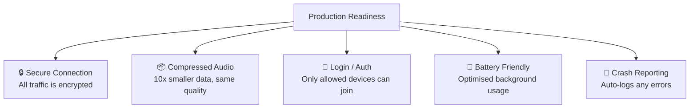

### Final Production Checklist

| Item | Why It Matters |
|------|---------------|
| Encrypted connection | Nobody can intercept the audio stream |
| Compressed audio format | Uses less data, works better on weaker WiFi |
| Device authentication | Only your Controllers can join your session |
| Background audio permission | Audio keeps playing even when screen is off |
| App store submission | Passes review for both iOS and Android |

### What We Check Before Releasing

| Test | We Pass If... |
|------|--------------|
| Connection is encrypted | No plain unencrypted traffic |
| Unauthorised devices are rejected | Random device can't connect without permission |
| Memory stays stable over 1 hour | No slowdown or crash from memory leaks |
| Battery drain is acceptable | Less than 15% per hour on the Master device |
| App passes store review | Approved on both App Store and Play Store |

---

## Full Timeline

```mermaid
gantt
    title App Development Timeline
    dateFormat  X
    axisFormat Week %s

    section Foundation
    Phase 1 - Audio Recording       :a1, 0, 5d
    Phase 2 - Device Connection     :a2, after a1, 5d

    section Streaming
    Phase 3 - Send Audio            :a3, after a2, 7d
    Phase 4 - Clock Sync            :a4, after a3, 6d

    section Reliability
    Phase 5 - Smooth Playback       :a5, after a4, 7d
    Phase 6 - Long-term Stability   :a6, after a5, 5d

    section Scale & Polish
    Phase 7 - Many Devices          :a7, after a6, 6d
    Phase 8 - Error Recovery        :a8, after a7, 4d
    Phase 9 - UI Design             :a9, after a8, 7d
    Phase 10 - Production           :a10, after a9, 7d
```

| Phase | Focus | Estimated Time |
|-------|-------|---------------|
| Phase 1 | Record audio on device | 3–5 days |
| Phase 2 | Connect devices over WiFi | 3–5 days |
| Phase 3 | Send audio across the network | 5–7 days |
| Phase 4 | Align all device clocks | 4–6 days |
| Phase 5 | Smooth playback with buffer | 5–7 days |
| Phase 6 | Long-session drift correction | 3–5 days |
| Phase 7 | Scale to 20+ Controllers | 4–6 days |
| Phase 8 | Auto-recovery from errors | 3–4 days |
| Phase 9 | App UI and screens | 5–7 days |
| Phase 10 | Security and production prep | 5–7 days |
| **Total** | | **~6–9 weeks** |

---

*Update each phase's checklist as you complete it. Don't move to the next phase until all checks pass.*